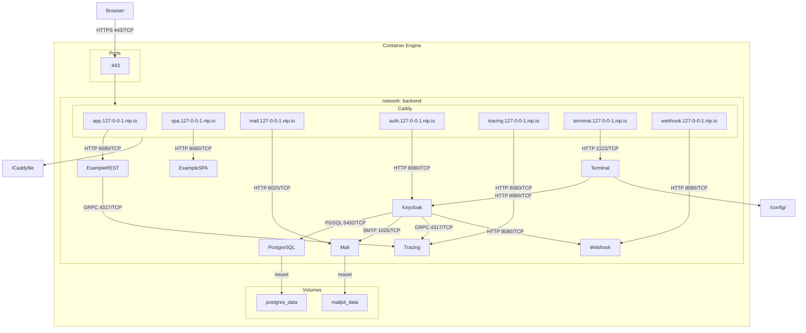
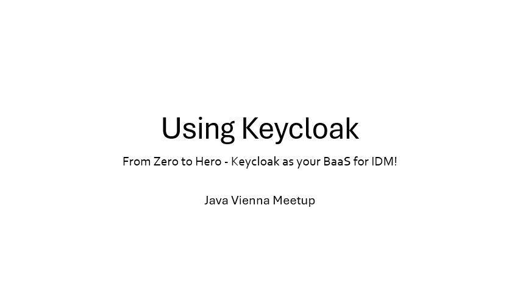

# Java Vienna Meetup Group - Using Keycloak to secure a Quarkus WebApp

This is a working PoC of Keycloak 26.x with 2 example applications (quarkus REST Backend and a React Single Page Application).
If you are confused by something, found a bug, got stuck or have an idea on how to improve this project, just open an issue
or better a PR.

Have fun playing around with it.

> **Disclaimer**: This is a setup that shows how Keycloak and OIDC works, it is not meant to be used as blueprint for
> production environments. Please read the appropriate guides, consult your security-exports of trust and do a solid
> PoC before considering implementing your own IdP-Service. If you are not willing or able to invest the time to do so,
> I would recommend sticking with an IdP-as-a-Service Provider of your choice 
> (0auth, Okta, Microsoft Entra ID, Amazon Cognito, Google Cloud Identity Platform, just to name a few).

## Setup



### Stack

* Hosting Proxy + TLS Handling: Caddy https://caddyserver.com/
* IdP
  * Keycloak https://www.keycloak.org/
  * PostgreSQL https://www.postgresql.org/
  * MailPit https://mailpit.axllent.org/
* Config-As-Code Example
  * TTYd https://github.com/tsl0922/ttyd
  * OpenTofu https://opentofu.org/
    * Keycloak Provider (new) https://registry.terraform.io/providers/keycloak/keycloak/latest/docs
    * Keycloak Provider (old) https://registry.terraform.io/providers/mrparkers/keycloak/latest/docs
* App Examples
  * Quarkus https://quarkus.io/
  * React https://react.dev/
    * OIDC SPA https://www.oidc-spa.dev/
* Tracing: JaegerUI https://github.com/jaegertracing/jaeger-ui
* Building: Maven https://maven.apache.org/

### Prerequisites

* podman or docker installed (podman desktop recommended)
* java 21+
* ~ 4GB RAM and >2CPU Cores
* Experience with java, linux, linux-containers and maven helps, but it should be doable without.

### Steps

* first run maven to build all dependencies, install the jars into the local maven-repo and builds all containers locally.
  * run `mvn clean install` inside the root project
* after caddy is online you have to get the temporary local ca to be able to connect to the applications without tls errors.
  * run `podman cp caddy:/data/caddy/pki/authorities/local/root.crt ./`
  * as admin: keytool -importcert -keystore "<JAVA_HOME>\lib\security\cacerts" -storepass changeit -noprompt -trustcacerts -alias caddy-ca -file "root.crt"
* now you should be able to reach keycloak, the jaeger-ui and the example-apps using nip.io domains (examples will not work until you complete the setup).
  * keycloak: https://auth.127-0-0-1.nip.io/
  * tracing: https://tracing.127-0-0-1.nip.io/
  * quarkus REST api example: https://app.127-0-0-1.nip.io/
  * SPA example: https://spa.127-0-0-1.nip.io/
* Login to keycloak with username "admin" and password "admin"
* Now we have to configure keycloak.
  * You can use the provided config container to execute the added terraform/opentofu IaC project
  * Just open the config-terminal in a browser https://terminal.127-0-0-1.nip.io and enter the following commands:
    ```bash 
    cd config
    tofu init
    tofu apply
    # type yes and hit enter 
    ```
  * this should give you a realm called "javavienna" with 2 users, 
    one admin "jv@example.com" (pw: admin) and one user user@example.com (pw: user)
* All examples should work now.

## Things to do

### View the quarkus app and click the different endpoints

* Open the quarkus-app at https://app.127-0-0-1.nip.io
* The Echo endpoint shows you your http request. Have a look at the headers and cookies.
* The User and Token endpoints are authenticated. Try to access them using the user-accounts from the Java-Vienna realm
* The details Endpoint is admin-only. See what happens if you try to use it with the user account
* Look at the echo endpoint after login, do you see any difference?
* Now you can refresh the tokens endpoint and wait for the access-token to expire (1min). What do you notice?

### View the quarkus app SwaggerUI

* Open the root-page and click on Swagger UI https://app.127-0-0-1.nip.io
* You see all endpoints but from a clients "perspective". The Swagger UI is now acting as a simple client to this very
    simple API. 
* Try to execute all statements. You should be able to get an echo, but the other endpoints should give you a 401 error.
* Try to click the login button in the right top corner. Select the "authorization_code flow" and hit login.
* This should lead you to the keycloak login page or should work without logging in if your session on keycloak is
    still intact. To force a login, go to keycloak, select the right realm, go to sessions and delete your session.
* After logging in you should be able to execute all endpoints you have access to.
* Look at the token endpoint, do you spot any difference to the call using your browser directly?
* You can also copy the bearer token to JWT.io to see what information can be gathered from the access_token
* Wait for the token to expire (1min) and try again, why is this happening? Why did it work in the browser?

### Single Page Application (SPA)

* Just open the spa example at https://spa.127-0-0-1.nip.io
* See the top right corner, are you already logged in? If not click login and login to keycloak.
* Click on the "My protected page" button in the top-middle.
* You should see the decrypted access token of the current user.
* You can also play around with the buttons on the bottom. Open your browser console to get some more insights of
  what is going on.
* You can also wait for your access token to expire. Check the console, how does it work?

### Custom User Attributes with custom validator

* The keycloak contains a custom validator plugin that can check if an attribute profile fields
  contains a valid country-code.
* Just login as admin
* Open the javavienna realm
* Go to users
* Click on a user
* You should see 2 custom fields "Java Experience" and "Location"
* Try to set something invalid to the location field (like TEST). 
* See that there is a generic error-message-id shown

If you want to add or modify fields, have a look at `Realm Sessions > User Profile`.

### Custom Themes

* There is a custom Account, Login and E-Mail Theme already added to this Keycloak.
* Login as admin
* Go to the javavienna realm
* Go to Realm Settings
* Select Themes
* Choose the Custom Theme for Account, Login and E-Mail.
* To see the changes, go to EMail and sendout a test-mail.
* Go to mailpit (https://mail.127-0-0-1.nip.io) and see the acsii-art added to the mail.
  * If you want to experiment with templated just edit the files in the keycloak-themes project.
* For the login changes, just try to login to some application on the javavienna realm. 
  You should see the "javavienna" banner in big red letters now.
* The account theme is only adding some text to the generic error that is shown if you enter a wrong country-code 
  as location in the user-profile.
* So login to the account-panel (https://auth.127-0-0-1.nip.io/realms/javavienna/account) and try to add
  something invalid as location (e.g. TEST). There is now a sensible error-message.

### Magic Link

* There is a custom magic-link Plugin (https://github.com/p2-inc/keycloak-magic-link) active in Keycloak, try to login to keycloak (e.g. using the Account-UI:
  https://auth.127-0-0-1.nip.io/realms/javavienna/account) and select "Try Another Way" on the login page.
* Select "Magic Link"
* Enter a valid email (e.g. user@example.com)
* Open the mocked mail-server at https://mail.127-0-0-1.nip.io, find the mail and click the link.
* You should be logged-in

### Webhook

* There is also a custom webhook plugin (https://github.com/vymalo/keycloak-webhook) installed and configured
* Login or trigger any other user-action
* Visit https://webhook.127-0-0-1.nip.io/s/11111111-2222-3333-4444-555555555555 to see incoming webhooks

### Tracing

* You can check out the minimal tracing setup at https://tracing.127-0-0-1.nip.io.
* Keycloak and the quarkus-app is pushing tracing-data using opentelemetry to a jaeger backend. 
  Feel free to look around. Nothing special but nice to get a bit of insight to the overall system.

### Config As Code

* The config-as-code part is currently using Terraform/Opentofu. You can play-around with it.
* Some tips to get you going:
  * Try changing things in the UI, run `tofu apply` and see what would be rolled-back as drift. Now you can use the
    official docs and console-output to find what you would have to change in the *.tf files to compensate those changes.
    About the apply, change things, run again, repeat until your tf-files are in sync with your manual changes.
  * This gives you a good idea of the terraform provider, also breaking down the keycloak data/config-model a bit.
* You can also try to look at the exported realm.json (Realm Settings > Actions > Partial Export) and try to
  figure out the mapping between the json, terraform and the UI.
* The AdminUI is just an interface to the Keycloak REST API, so looking at the requests when triggering changes can get
  you quite far.
* If you what a challenge, try to port the IaC code over to something else
  * 

## Further readings

* The official documentation has gained a lot of quality in the past months. Give it a look: https://www.keycloak.org/documentation
* There is also a dedicated "guides" section now, also very read-worthy: https://www.keycloak.org/guides
* Regarding Config-As-Code: I actively picked the TF provider over KC-Config-CLI (https://github.com/adorsys/keycloak-config-cli) 
  because the provider was adopted by the keycloak-team and has had a lot of improvements over the past months, 
  but there is nothing wrong with the config-cli. Try it out, many ppl out there are using it.
* There is also a full "DIY CaC" example here: https://github.com/MaikKingma/keycloak-configAsCode-demo Give it a
  try if you have to manage a very big and complex Keycloak Installation. Sometimes "doing it the hard way" is the right
  way to do it.
* Join us on one of the many community meetings around the world. Follow us here: https://www.keycloak.org/community

## Presentation

[](https://riitat-my.sharepoint.com/:p:/g/personal/michael_riedmann_riit_at/EVt7ar6-6otOtf-7iLATXBIBNlAxPnGfOaTcwuq0Go5VgA?e=PcdX6c)
